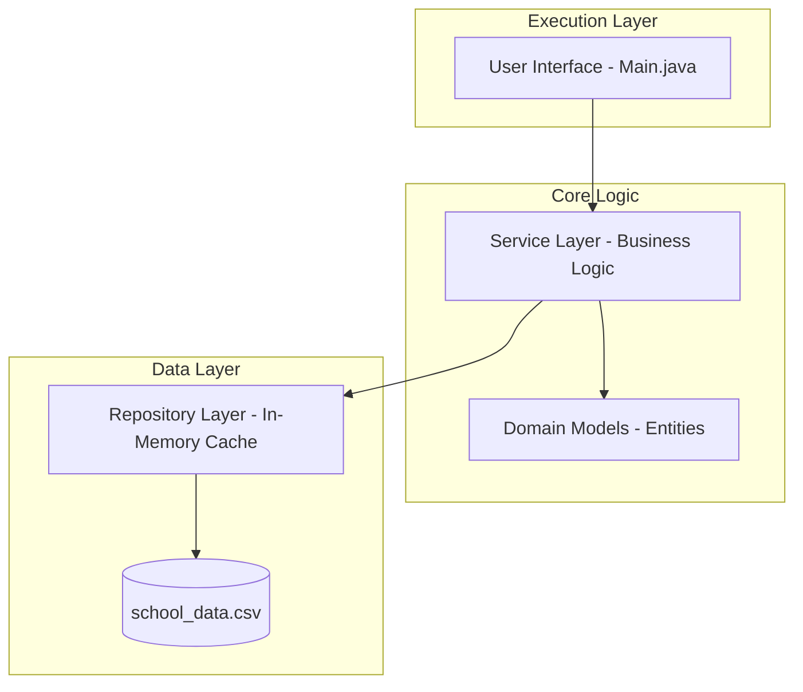

# 🎓 Student Management System

[](https://www.oracle.com/java/)
[]()
[](https://opensource.org/licenses/MIT)

A professional, feature-rich Java console application designed for educational institutions to efficiently manage student records, academic courses, and enrollment processes. Built with a clean **Multi-Layered Architecture**, this system demonstrates best practices in Java development, including SOLID principles, separation of concerns, and robust data persistence.

---

## 📖 Description

The **Student Management System** is a comprehensive administrative tool that streamlines the management of academic data. In modern educational environments, tracking student progress, course availability, and enrollment statuses manually is prone to errors. This system solves these issues by providing a centralized, terminal-based hub for:

- **Data Integrity**: Centralized storage with validated inputs ensures information remains accurate.
- **Efficiency**: Quick search, sort, and reporting tools save administrative time.
- **Persistence**: Automatic CSV synchronization ensures data is never lost between sessions.

---

## 🚀 Features

The system is packed with functionalities mapped across four main categories:

### 🎓 Student Management

- **Add/Remove Students**: Registration and alumni management.
- **Update Profiles**: Modify student names and details.
- **Search & Filter**: Find students by name or ID instantly.
- **Sorting**: Organize students alphabetically or by academic performance.
- **Reporting**: View "Top Students" and "Failed Students" (Average < 50).

### 📚 Course Management

- **Course Catalog**: Define courses with unique codes and names.
- **Lifecycle Management**: Add, update, or remove courses from the curriculum.
- **Popularity Tracking**: Identify which courses have the highest enrollment.

### 📝 Enrollment & Grades

- **Smart Enrollment**: Link students to courses with duplicate-prevention logic.
- **Grade Recording**: Enter and update marks (0-100) for specific subjects.
- **GPA Calculation**: Automatically calculate a student's Weighted Grade Point Average.
- **Unenrollment**: Handle course drops or schedule changes easily.

### 📊 System Utilities

- **Persistent Storage**: All data is saved to `school_data.csv`.
- **System Statistics**: Instant dashboard showing total students, courses, and system-wide GPA.
- **Robust Input**: Safe input handling preventing crashes on invalid data types.

---

## 🛠 Technologies Used

- **Core Engine**: Java SE 17+ (utilizing Streams, Optional, and Lambda expressions).
- **Design Pattern**: Multi-Layered Service/Repository Pattern.
- **Data Format**: CSV (Comma Separated Values) for lightweight storage.
- **Build/Tools**: Standard JDK Tools (`javac`, `java`).

---

## 📂 Project Structure

The project follows a modular package structure to ensure high maintainability:

```text
src/
├── main/               # Application entry point and UI orchestrator
│   └── Main.java       # Handles the terminal menu and user interactions
├── model/              # Domain Entity classes (POJOs)
│   ├── Student.java    # Core student data and enrollment list
│   ├── Course.java     # Academic subject definitions
│   └── Enrollment.java # Join entity linking Student to Course with Grades
├── service/            # Business Logic Layer
│   ├── StudentService.java     # Logic for searching, sorting, and top students
│   ├── CourseService.java      # Course-specific logic
│   └── EnrollmentService.java  # The "Engine" merging students and courses
├── repository/         # Data Access Layer (In-memory Collections)
│   ├── StudentRepository.java  # Storage for Student objects
│   └── CourseRepository.java   # Storage for Course objects
└── util/               # Cross-cutting Utilities
    ├── DataManager.java        # IO logic for CSV loading/saving
    └── InputHelper.java        # Robust terminal input validation
```

---

## 🏗 System Architecture

The application implements a **unidirectional data flow** to keep the codebase clean and easy to debug.

### 📊 Logical Flow Diagram



### 🧱 Architectural View (ASCII)

```text
  [ User ]
     |
     v
[ Main Class ] <---- (Orchestration)
     |
     +----[ Services ] ----> [ Models ]
              |                  ^
              v                  |
       [ Repositories ] ---------+
              |
              v
      [ school_data.csv ]
```

---

## ⚙️ How to Run

### 1. Prerequisites

- **JDK 17** or higher installed on your system.
- Check version with: `java -version`

### 2. Compilation

Compile all packages from the project's root directory:

```bash
javac -d bin main/*.java model/*.java repository/*.java service/*.java util/*.java
```

### 3. Execution

Launch the application by pointing to the main class:

```bash
java -cp bin main.Main
```

---

## 💡 Sample Usage & Code Snippets

### Terminal Interface Example

```text
--- Student Management System ---
Choose an option: 1
Enter Student ID: 202401
Enter Name: Alex Rivers
Success: Student added.

Choose an option: 9
Enter Student ID: 202401
Enter Course Code: CS101
Success: Enrolled.
```

### Key Operation: Enrollment Logic (Java)

The `EnrollmentService` ensures that business rules (like preventing duplicate enrollment) are enforced:

```java
// Simplified internal logic from EnrollmentService.java
public void enrollStudentInCourse(int studentId, String courseCode) {
    Student student = studentService.getById(studentId);
    Course course = courseService.getByCode(courseCode);

    // Prevent duplicate enrollment
    boolean exists = student.getEnrollments().stream()
            .anyMatch(e -> e.getCourse().equals(course));

    if (!exists) {
        Enrollment enrollment = new Enrollment(student, course);
        student.addEnrollment(enrollment);
    }
}
```

### Key Operation: GPA Calculation

```java
// Grading logic
public double calculateGPA(int studentId) {
    Student student = studentService.getById(studentId);
    return student.getEnrollments().stream()
            .mapToDouble(Enrollment::getGrade)
            .average()
            .orElse(0.0);
}
```

---

## 🤝 Contribution Guidelines

We welcome contributions to improve the system's logic or UI!

1. **Fork** the repository.
2. **Create** your feature branch (`git checkout -b feature/NewFeature`).
3. **Commit** your changes (`git commit -m 'Add NewFeature'`).
4. **Push** to the branch (`git push origin feature/NewFeature`).
5. **Open** a Pull Request.

---

## ⚖️ License

Distributed under the **MIT License**. See settings for more details.

---

## 📧 Contact Information

**Developer**: Mahmoud Olaim  
**GitHub**: [mahmoudolaim682](https://github.com/mahmoudolaim682)  
**Project Link**: [Student Management System](https://github.com/mahmoudolaim682-source/Final-Student_Management_System)

---

_Generated with ❤️ for the Java Developer Community._
