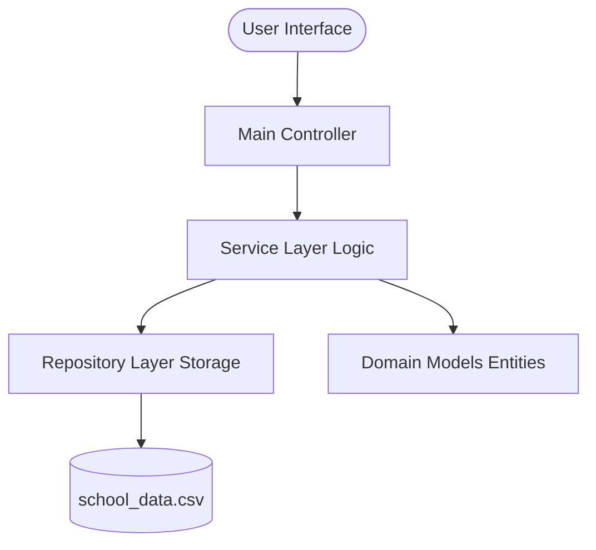

# Student Management System

[](https://www.oracle.com/java/)
[]()

A professional, refactored Java console application designed for educational institutions to efficiently manage student records, academic courses, and enrollment processes. This system follows a clean multi-layered architecture, ensuring scalability, maintainability, and clear separation of concerns.

## 📖 Description

The **Student Management System** is a comprehensive solution for administrators to handle daily academic operations. It solves the problem of fragmented data management by providing a centralized terminal-based interface to track student profiles, course offerings, and academic performance (grades).

Whether you need to quickly look up a student's GPA, manage course capacity, or enroll a batch of new students, this system provides the tools to do so with speed and reliability.

## 🚀 Features

- **🎓 Student Management**: Add new students, update profiles, or remove alumni with ease.
- **📚 Course Management**: Create and maintain a catalog of courses with unique codes.
- **📝 Enrollment Engine**: Seamlessly enroll or unenroll students in courses.
- **📊 Grade Tracking**: Record and update grades for specific course enrollments.
- **🔍 Advanced Search**: Search for students by name or courses by their specific codes.
- **📂 Persistent Storage**: All data is automatically saved to and loaded from `school_data.csv`.
- **📈 Sorting & Reporting**: Sort students by name or grade performance, and generate full system reports.

## 🛠 Technologies Used

- **Language**: Java SE 17+
- **Architectural Pattern**: Layered Architecture (Models, Services, Repositories)
- **Data Persistence**: CSV-based File I/O
- **Logic**: Java Streams API, Collections Framework, and OOP Principles

## 📂 Project Structure

The project is organized into distinct packages for better modularity:

```text
src/
├── main/               # Application entry point and UI controller
│   └── Main.java       # Handles user menu and orchestration
├── model/              # Data Entity classes
│   ├── Student.java    # Student profile and enrollment data
│   ├── Course.java     # Course details
│   └── Enrollment.java # Links Students to Courses with Grades
├── service/            # Business Logic Layer
│   ├── StudentService.java
│   ├── CourseService.java
│   └── EnrollmentService.java
├── repository/         # Data Access Layer (In-memory storage)
│   ├── StudentRepository.java
│   └── CourseRepository.java
└── util/               # Helper utilities
    ├── DataManager.java # Handles CSV Load/Save logic
    └── InputHelper.java # Robust terminal input handling
```

## 🏗 System Architecture

The following diagram illustrates the unidirectional flow of data and commands through the system layers:



_Flow: Main UI interacts with Services -> Services process logic using Models -> Services store/retrieve data via Repositories -> Repositories sync with File System._

## ⚙️ How to Run

Follow these steps to get the system running locally:

### Prerequisites

- Ensure you have **JDK 17** or higher installed.

### Steps

1. **Clone the Repository**:

   ```bash
   git clone https://github.com/yourusername/student-management-system.git
   cd student-management-system
   ```

2. **Compile the Project**:
   From the root directory:

   ```bash
   javac -d bin main/*.java model/*.java repository/*.java service/*.java util/*.java
   ```

3. **Run the Application**:
   ```bash
   java -cp bin main.Main
   ```

## 💡 Sample Usage

### Adding a Student

When the application starts, select option `1` to add a student:

```text
Choose an option: 1
Enter Student ID: 101
Enter Name: John Doe
Success: Student added.
```

### Enrolling in a Course

Select option `9` to link a student to a course:

```text
Choose an option: 9
Enter Student ID: 101
Enter Course Code: CS101
Success: Enrolled.
```

### Recording a Grade

Select option `10` to award marks:

```text
Choose an option: 10
Enter Student ID: 101
Enter Course Code: CS101
Enter Grade (0-100): 95.5
Success: Grade recorded.
```

### ☕ Developer Guide: Key Operations (Java)

If you're looking to extend the system, here's how the core services handle student addition and enrollment:

#### Adding a Student

```java
StudentRepository studentRepo = new StudentRepository();
StudentService studentService = new StudentService(studentRepo);
// Parameters: (id, name)
studentService.addStudent(1, "Alice Johnson");
```

#### Enrolling a Student

```java
EnrollmentService enrollmentService = new EnrollmentService(studentService, courseService);
// Parameters: (studentId, courseCode)
enrollmentService.enrollStudentInCourse(1, "MATH101");
```

## 🤝 Contribution Guidelines

Contributions are what make the open-source community such an amazing place to learn, inspire, and create.

1. Fork the Project
2. Create your Feature Branch (`git checkout -b feature/AmazingFeature`)
3. Commit your Changes (`git commit -m 'Add some AmazingFeature'`)
4. Push to the Branch (`git push origin feature/AmazingFeature`)
5. Open a Pull Request

## ⚖️ License

Distributed under the MIT License. See `LICENSE` for more information.

## 📧 Contact

**Project Maintainer**: Your Name  
**Email**: mahmoudolaim682@gmail.com  
**Project Link**: [https://github.com/Mahmoud/student-management-system](https://github.com/Mahmoud/student-management-system)
